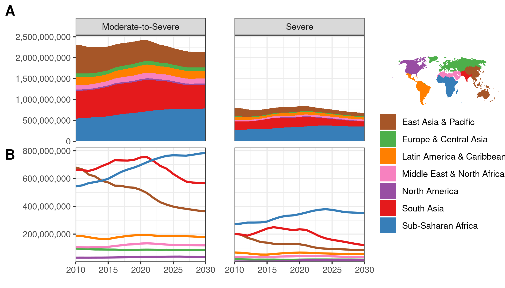

# A Global Picture of Hunger
Food insecurity has been increasing for the past several years, and has been recently further exacerbated by the coronavirus [^1].  But what can we expect for the next decade?  What will current trends in climate change, economic growth, and demographic shifts mean for food security throughout the 2020s?  With data from the FAO in partnership with Gallup World Poll, the World Data Lab has used machine learning and the latest forecasts of global change to estimate how global dynamics of food insecurity are expected to change in the coming decade.   Starting from World Food Day, this forecast will be displayed at subational spatial resolution on [The World Hunger Clock](worldhunger.io), allowing policymakers to answer important questions about hunger.

# The Experience of Food Insecurity
Scientists have been studying food security for decades, and for many years, they relied on crude metrics, such as food available per-capita, or the rate of stunting among children.  However, these methods come with a variety of problems.  Looking at the amount of food stored in national reserves doesnt account for inequalities in access to that food, while population level metrics like rates of stunting are confounded by things like infectious disease and parasties.

Today, scientists use a new metric called the Food Insecurity Experience Scale, which measures peoples lived experiences of hunger, rather than just crude proxies for hunger.  It involves questions about skipping meals, running out of food, and worrying about having enough to eat over the previous year.  As one of the most informative and cross-culturally valid metrics of food insecurity, it was selected as one of the key indicators for the second Sustainable Development Goal of Zero Hunger.  Now, with the World Hunger Clock, it is possible to explore this important metric at high spatial resolution including projections into the future.

# Modeling Food Insecurity
We used data from several published studies that had subnational predictions of how things like wealth, education, demographics, urbanization, and the weather are expected to change over the coming years.  Based on these variables, we used machine learning to estimate how all of these things relate to the levels of food insecurity.  Our model was able to predict rates of food insecurity with very high accuracy (r-squared = 0.99), meaning that it is possible to infer food security level based on all of the variables we analyzed.  Finally, based on how those variables are likely to change in the coming years, we've estimated future rates of food insecurity.

These predictions are based on a big caveat: our data is based on the assumption that current trends continue as expected.  In many cases this is a reasonable assumption.  For example, demographic patterns are easy to anticipate - we know with certainty that people aged 20 in the year 2020 will by 30 years old by 2030.  Similarly, patterns of urbanization and economic growth have maintained steady trajectories for decades and will likely continue on their current path through to 2030.  Nevertheless, as the coronovirus illustrated, there are always "black swan" events that no model can anticipate.  Our model shows the best estimate that we can make with the information that we have available at the present.

# Where Thing Are Getting Worse and Where They Are Getting Better
We used our model to predict both moderate food insecurity - eating less than you would like, as well as severe food insecurity - going an entire day without eating.  The figure below shows our results, broken down by world region.  On the whole, in recent years, both moderate and severe food insecurity have been on the rise in terms of absolute numbers.  Due to the impact of the coronavirus on the global food system, 2020 and 2021 will see the highest levels of hunger in over a decade.  Today, nearly 2.5 billion people - almost a full third of the world's population - have some level of hunger, due to lacking the resources to purchase the food they would like, while 800,000 people are severely food insecure, going entire days without eating at least once.  

Breaking down our model's predictions by world region shows a dynamic picture.  East Asia and the Pacific has been continuing a pattern of increasing development and access to food, as the number of food insecure people has decreased and will continue to due so.  Not only are people leaving a state of food insecurity and poverty, but people are achieving a middle-class lifestyle. Increasingly, the challenge people and policymarkers face in this region is not eating enough but eating well - having diets that do not lead to obesity and that do not have an excessive impact on the environment.

In Sub-saharan Africa, on the other hand, the number of food insecure will continue to rise.  While economic development will continue rapidy, in many parts of Africa, the population will grow at a pace that keeps per-capita income and poverty low enough that acheiving food security will be out of reach for many.  Many lower-middle income African countries will make large strides in decreates the rate of food security, particularly Senegal, Ghana, Nigeria, Kenya, and Ethiopia, but in absolute numbers, food insecurity will continue to increase throughout the continent, particuarly in the interior countries where economic development and the demographic transition have been slow to reach.  Africa is also the continent that will be most impacted by climate change over the coming decade, as it is already the continent with the most people living in hot, arid areas that are dependent on their own food production to meet their food security needs.

Finally, south Asia is predicted to turn a corner on food insecurity.  Having seen the number of hungry people increase throughout the last decade, the number of both moderate and severely food insecure people will begin to decrease in the early 2020s.  This is due to a combination of economic growth bringing people out of poverty as well as the fruits of long-term trends in reduced stunting and malnutrition.

[^1]: http://www.fao.org/3/ca9692en/online/ca9692en.html

