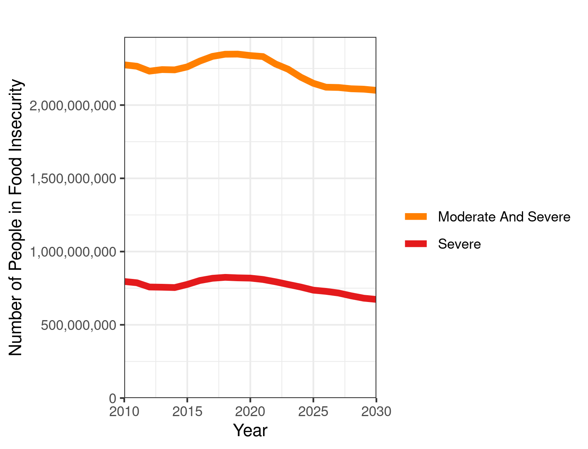

# A Global Picture of Hunger
Food insecurity has been increasing in recent years, and has been further exacerbated in 2020 by the coronavirus [^1].  But what can we expect for the next decade?  What will current trends in climate change, economic growth, and demographic shifts mean for food security throughout the 2020s?  With data from the FAO in partnership with Gallup World Poll, the [World Data Lab](https://worlddata.io) has used machine learning techniques and the latest forecasts of global change to estimate how global dynamics of food insecurity are expected to change in the coming decade.   Starting from World Food Day, this forecast will be displayed at subnational spatial resolution on [The World Hunger Clock](https://worldhunger.io), allowing policymakers to answer important questions about hunger.

Scientists have been studying food security for decades, and for many years, they relied on crude metrics, such as food available per capita, or the rate of stunting among children.  However, these methods come with a variety of problems.  Looking at the amount of food stored in national reserves doesn't account for inequalities in access to that food, while population level metrics like rates of stunting are confounded by things like infectious disease and parasites.

Today, scientists use a new metric called the [Food Insecurity Experience Scale](http://www.fao.org/in-action/voices-of-the-hungry/fies/en/), which measures peoples lived experiences of hunger, rather than just crude proxies for hunger.  It involves questions about skipping meals, running out of food, and worrying about having enough to eat over the previous year.  As one of the most informative and cross-culturally valid metrics of food insecurity, it was selected as one of the key indicators for the second Sustainable Development Goal of Zero Hunger.  Now, with the World Hunger Clock, it is possible to explore this important metric at high spatial resolution including projections into the future.

To map world hunger, we trained a machine learning model with the best data available today on things like wealth, education, demographics, urbanization, and the climate to train a machine learning model.  Our model was able to predict recent historic rates of food insecurity with very high accuracy.  Then, based on how those variables are likely to change in the coming years, we estimated rates of food insecurity into the future.  Similarly to the World Poverty Clock, we will update our model as new data becomes available.

# Where Thing Are Getting Worse and Where They Are Getting Better
We used our model to predict both moderate food insecurity - eating less than you would like, as well as severe food insecurity - going an entire day without eating.  The figure below shows our results, broken down by world region.  On the whole, in recent years, both moderate and severe food insecurity have been on the rise in terms of absolute numbers.  Due to the impact of the coronavirus on the global food system, 2020 and 2021 will see the highest levels of hunger in over a decade.  Today, nearly 2.5 billion people - almost a full third of the world's population - have some level of hunger, due to lacking the resources to purchase the food they would like, while 800,000 people are severely food insecure, going entire days without eating at least once.  

Breaking down our model's predictions by world region shows a dynamic picture.  East Asia has been continuing a pattern of increasing development and access to food, so the number of food insecure people has decreased and will continue to due so.  Not only are people leaving a state of food insecurity and poverty, but people are achieving a middle-class lifestyle. Increasingly, the challenge people and policymakers face in this region is not eating enough but eating well - having diets that do not lead to obesity and that do not have an excessive impact on the environment.

In Sub-Saharan Africa, on the other hand, the number of food insecure will continue to rise.  While economic development will continue rapidly, in many parts of Africa, population growth will outpace the improvements in food security.  Many lower-middle income African countries will make large strides in decreasing the rate of food security, particularly Senegal, Ghana, Nigeria, Kenya, and Ethiopia, but in absolute numbers, food insecurity will continue to increase throughout the continent.

Finally, South Asia is predicted to turn a corner on food insecurity.  Having seen the number of hungry people increase throughout the last decade, the number of both moderate and severely food insecure people will begin to decrease in the early 2020s.  This is due to a combination of economic growth bringing people out of poverty as well as the fruits of long-term trends in reduced stunting and malnutrition.

As the recent well-deserved Nobel Peace Price received by the World Food Programme shows, ensuring that all people on earth have access to safe, nutritious and sufficient is an important goal to strive for, and many organizations are currently paying attention to global hunger.  The new World Hunger Clock will contribute to global efforts to achieve this goal and help policymakers to better understand where hunger still exists and how it is changing.

[^1]: http://www.fao.org/3/ca9692en/online/ca9692en.html

